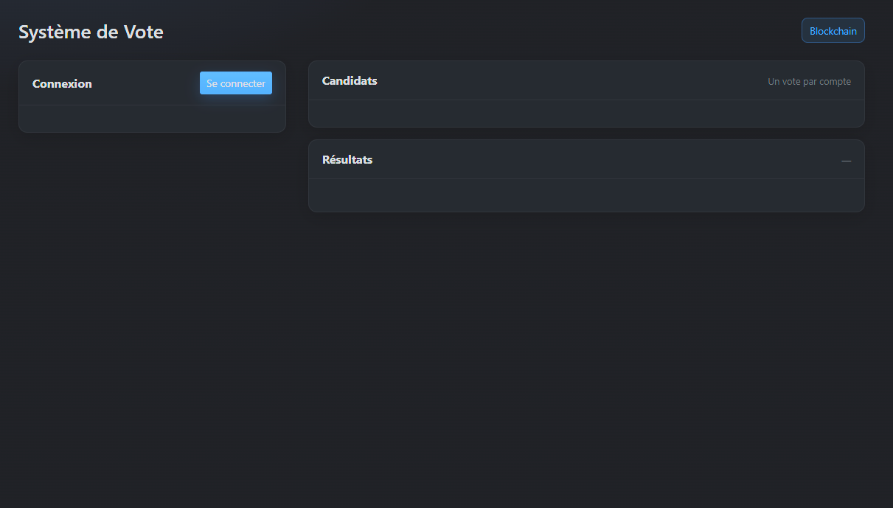
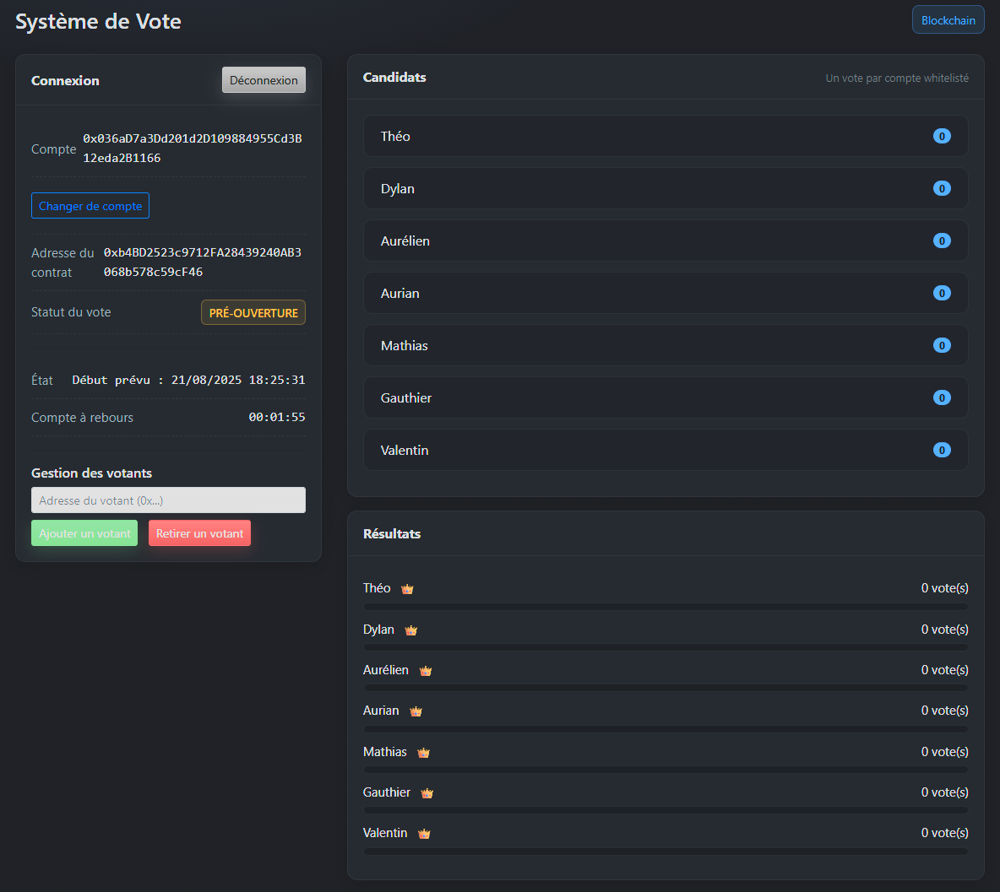
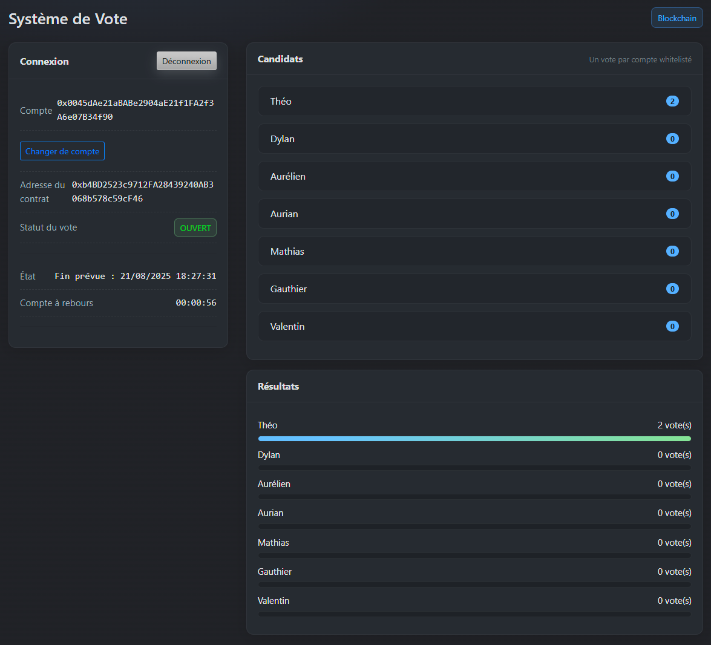
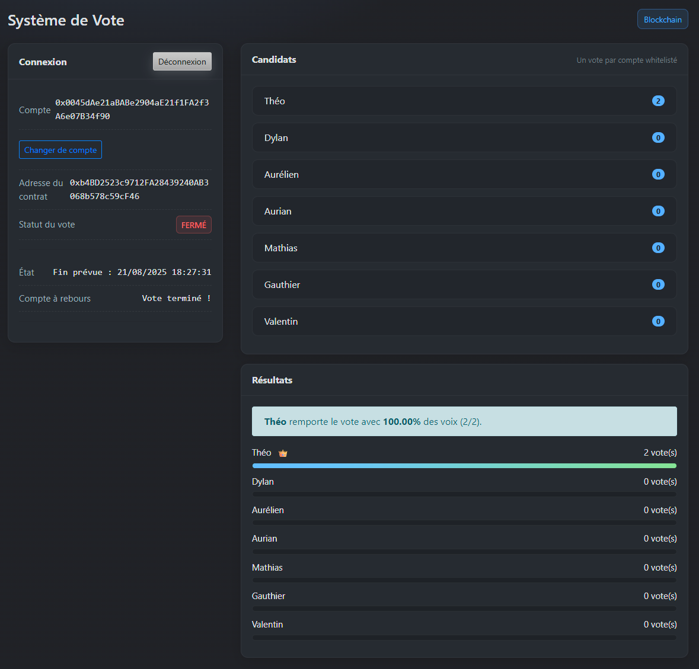
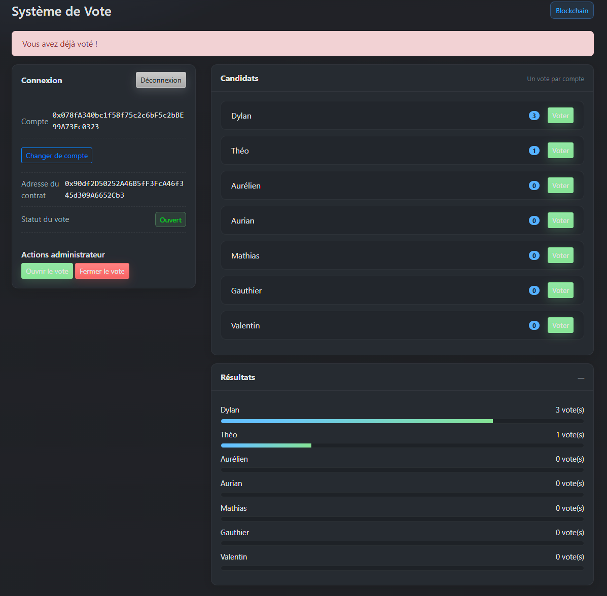

# 🗳️ Système de Vote sur la Blockchain – Projet Étudiant

## 🎯 Objectif

Ce projet a été réalisé dans le cadre d’un devoir pratique visant à créer un **système de vote sécurisé et transparent sur la blockchain Ethereum**. Il permet à chaque électeur de voter **une seule fois**, et à tous les utilisateurs de **consulter les résultats** librement.

---

## ⚙️ Fonctionnalités

- ✅ Dépôt de vote unique par adresse Ethereum
- ✅ Comptabilisation sécurisée des votes
- ✅ Résultats visibles en temps réel
- ✅ Interface web simple et intuitive
- ✅ Interaction avec MetaMask
- ✅ Scripts de simulation et de test

---

## 🧱 Technologies utilisées

- [Solidity](https://docs.soliditylang.org) – Smart contract
- [Truffle](https://trufflesuite.com/truffle/) – Framework de développement Ethereum
- [Ganache](https://trufflesuite.com/ganache/) – Blockchain locale
- [Web3.js](https://web3js.readthedocs.io/) – Interaction avec Ethereum depuis le front-end
- [MetaMask](https://metamask.io/) – Portefeuille Ethereum pour le navigateur
- HTML/CSS – Interface utilisateur
- JavaScript (Node.js)

---

## 📁 Structure du projet

```bash
/blockchain
├── /build               # Build Truffle (auto-généré)
├── /contracts
│   └── Vote.sol         # Smart contract principal
├── /migrations
│   └── 2_deploy_vote.js
├── /test
│   └── voting.test.js   # Tests unitaires Truffle
├── abi.js               # Export de l’ABI pour l’interface Web
├── app.js               # Script client (Web3 + MetaMask)
├── index.html           # Interface Web
├── styles.css           # Feuille de style
├── truffle-config.js    # Configuration réseau Truffle
├── package.json
└── README.md
```

---

## 🚀 Installation & Exécution

### 1. Prérequis

- Node.js
- Truffle
- Ganache
- MetaMask

### 2. Installation

```bash
cd blockchain
npm install
```

---

## 👥 Répartition des tâches

### 🔹 Smart Contract (Solidity)

**Dylan Samson & Gauthier Delzenne**

- Développement du contrat `Vote.sol`
- Logique principale :
  - Liste des candidats
  - Système de vote unique (`hasVoted`)
  - Gestion du statut du vote (ouvert/fermé)
  - Comptage des voix
- Définition des événements :
  - `Voted(address voter, uint candidateIndex)`
- Documentation et commentaires dans le code

---

### 🔹 Migration & Déploiement

**Valentin Longagnani & Théo Narberger**

- Mise en place et maintenance des migrations Truffle (`2_deploy_vote.js`)
- Déploiement du contrat sur réseau local (Ganache) ou testnet
- Paramétrage initial (liste des candidats)
- Communication de l’adresse du contrat à l’équipe pour l’UI et les scripts

---

### 🔹 Tests (Node.js / Truffle)

**Aurian Bohn & Mathias Crochet**

- Rédaction et maintenance du test unitaire `voting.test.js`
  - Vérifications : initialisation correcte, vote unique, vote invalide, statut fermé
- Intégration avec le contrat :
  - Utilisation des artefacts Truffle / ABI
  - Tests sur l’adresse du contrat déployé

---

### 🔹 Interface Web & Intégration MetaMask

**Aurélien Rosello, Dylan Samson & Gauthier Delzenne**

- Création de l’interface Web (`index.html`, `app.js`)
- Connexion avec MetaMask (lecture/écriture sur le contrat)
- Affichage dynamique :
  - Liste des candidats
  - Résultats des votes
  - Statut du vote (ouvert / fermé)
- Gestion des erreurs utilisateur :
  - Vote multiple
  - Index de candidat invalide
  - Compte MetaMask non connecté
  - Réseau non compatible

---

### 🔹 UI/UX & Présentation

**Mathias Crochet & Théo Narberger**

- Amélioration visuelle via `styles.css`
- Organisation claire de l’affichage :
  - Cartes de candidats
  - Barres de progression des résultats
  - Messages d’état et notifications
- Préparation des captures d’écran ou d’une démo courte pour le livrable final

---

## 🛠️ Notes techniques

- **Outil de déploiement** : Truffle (`2_deploy_vote.js`)
- **Tests unitaires** : Truffle + Chai (`voting.test.js`) avec `chai-as-promised`
- **Scripts de simulation** : Node.js (`vote.js`, `results.js`)
- **Interface** : consomme l'ABI et l'adresse du contrat déployé, fournies par l’équipe Déploiement

---

## 📸 Captures d’écran du projet

### Connexion à Metamask



### Liste des candidats : vote ouvert



### Présentation des résultats : vote fermé



### Message d'erreur : vote déjà effectué



### Message d'erreur : tentative de fermeture par un utilisateur non autorisé


